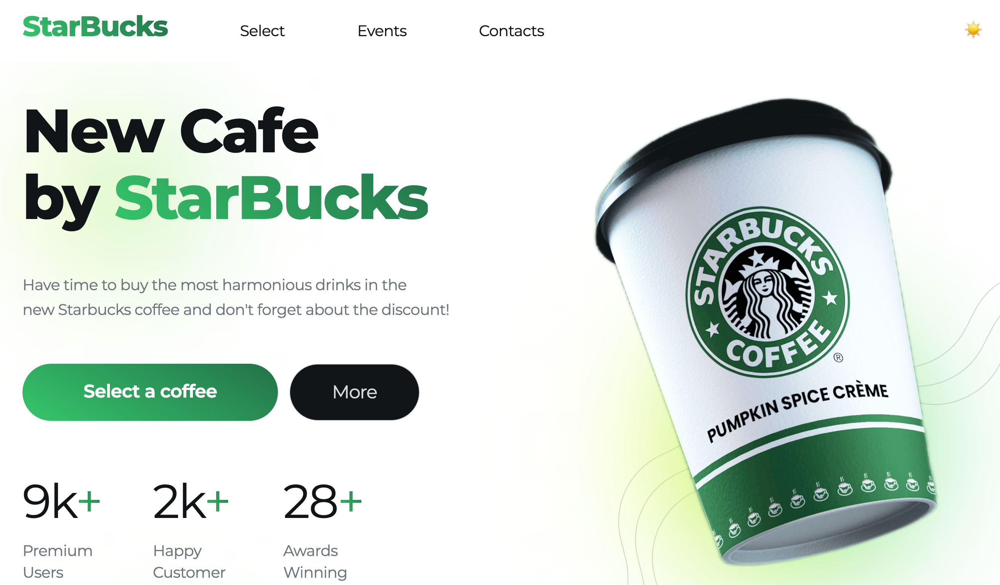

# ☕ Coffee Landing Page

<div align="center">


Современный адаптивный лендинг для кофейни Starbucks с интерактивными элементами и плавной анимацией.

[Демо](#) • [Исходный код](#) • [Особенности](#-особенности)

</div>

## 🖼️ Предпросмотр проекта

### Темная тема (по умолчанию)


### Светлая тема




## ✨ Особенности

- 🎨 **Современный дизайн** - Чистый интерфейс с градиентными акцентами
- 🌓 **Темная и светлая тема** - Переключение между темами с сохранением выбора
- 📱 **Полная адаптивность** - Оптимизирован для всех устройств
- 🍔 **Гамбургер-меню** - Адаптивная мобильная навигация с плавными анимациями
- 🔝 **Фиксированная шапка** - Умная навигация с эффектом при скролле
- ⚡ **Плавные анимации** - CSS-анимации и плавные переходы
- 🎯 **Интерактивные элементы** - Карточки товаров и событий
- 🚀 **Быстрая загрузка** - Оптимизированная производительность

## 🛠️ Технологии

| Технология | Описание |
|-----------|----------|
| **HTML5** | Семантическая разметка |
| **CSS3** | Flexbox, Grid, анимации, градиенты, CSS-переменные |
| **JavaScript (ES6+)** | Классы, управление темами, мобильное меню, плавная навигация |
| **LocalStorage API** | Сохранение выбранной темы пользователя |
| **Google Fonts** | Шрифт Montserrat |

## 📁 Структура проекта

```
coffee-landing/
│
├── 📄 index.html
├── 🎨 style.css
├── 📜 script.js
├── 📁 images/
│   ├── 📁 cups/
│   │   ├── green-big.png
│   │   ├── green.png
│   │   ├── brown.png
│   │   └── yellow.png
│   ├── 📁 icons/
│   │   ├── 📁 3d/
│   │   │   ├── heart.png
│   │   │   ├── rocket.png
│   │   │   └── money.png
│   │   ├── arrow.svg
│   │   ├── lines.svg
│   │   ├── phone.png
│   │   └── star.svg
│   ├── 📁 events/
│   │   ├── 1.png
│   │   ├── 2.png
│   │   ├── 3.png
│   │   ├── 4.png
│   │   └── 5.png
│   ├── kitchen.jpg
│   ├── room.jpg
│   ├── signboard.jpg
│   └── screenshot.png
│
└── 📄 README.md
```

## 🚀 Быстрый старт

### Установка и запуск

1. **Клонируйте репозиторий**
   ```bash
   git clone https://github.com/kost191027/coffee-landing.git
   cd coffee-landing
   ```

2. **Откройте в браузере**
   - Просто откройте `index.html` в вашем браузере
   - Или используйте Live Server в VS Code

### Настройка под ваш проект

- Замените контент и изображения
- Обновите цветовую схему в CSS
- Настройте контактную информацию

## 📱 Адаптивность

| Устройство | Разрешение | Особенности |
|-----------|-----------|-------------|
| 💻 **Десктоп** | 1200px+ | Полная функциональность, горизонтальное меню |
| 📱 **Планшеты** | 768px - 1199px | Адаптивная сетка, оптимизированная навигация |
| 📱 **Мобильные** | до 500px | Гамбургер-меню, вертикальная навигация, оптимизированный контент |

## 🎨 Секции сайта

| Секция | Описание |
|--------|----------|
| 🏠 **Hero** | Приветственный блок с CTA |
| ⭐ **Преимущества** | Ключевые преимущества кофейни |
| 📖 **История** | О компании и философии |
| ☕ **Продукция** | Карточки кофейных напитков |
| 🎉 **События** | Мероприятия и акции |
| 📞 **Контакты** | Контактная информация |

## 🌓 Система тем

Проект поддерживает две цветовые темы: **темную** (по умолчанию) и **светлую**. Переключение между темами реализовано через современный подход с использованием CSS-переменных и атрибута `data-theme`.

### Функционал переключения тем

- **Автоматическое сохранение** - Выбранная тема сохраняется в `localStorage` и восстанавливается при следующем посещении
- **Плавная анимация** - Переход между темами происходит с плавной анимацией (0.3s)
- **Визуальная индикация** - Кнопка переключения отображает текущую тему (🌙 для темной, ☀️ для светлой)
- **Глобальное применение** - Все элементы интерфейса автоматически адаптируются под выбранную тему

### Техническая реализация

Система тем построена на основе CSS-переменных, что обеспечивает:

- **Централизованное управление** - Все цвета определены в `:root` и `[data-theme="dark"]`
- **Производительность** - Переключение происходит мгновенно без перезагрузки страницы
- **Расширяемость** - Легко добавить новые темы или изменить существующие

### Цветовые схемы

**Темная тема (по умолчанию):**
- Фон: `#121517`
- Текст: `#ffffff`
- Акцент: `#35c66b` (градиент от `#237249`)

**Светлая тема:**
- Фон: `#ffffff`
- Текст: `#121517`
- Акцент: `#237249` (градиент от `#237249` до `#35c66b`)

### Использование

Кнопка переключения темы расположена в правой части шапки сайта. При клике происходит мгновенное переключение с сохранением выбора пользователя.

```javascript
// Пример работы ThemeManager
const themeManager = new ThemeManager();
// Автоматически инициализируется при загрузке страницы
```

## 📱 Мобильная навигация

Для обеспечения оптимального пользовательского опыта на мобильных устройствах реализовано адаптивное гамбургер-меню.

### Функционал гамбургер-меню

- **Адаптивное отображение** - Меню автоматически появляется на экранах шириной до 500px
- **Плавная анимация** - Открытие и закрытие меню сопровождается плавными CSS-анимациями
- **Overlay-эффект** - При открытии меню фон затемняется для фокусировки внимания
- **Автоматическое закрытие** - Меню закрывается при клике на ссылку или вне области меню
- **Блокировка скролла** - При открытом меню скролл страницы блокируется для удобства навигации
- **Плавная прокрутка** - При клике на ссылку происходит плавная прокрутка к соответствующей секции

### Техническая реализация

Мобильное меню реализовано через класс `MobileMenu`, который:

- Создает overlay-элемент динамически
- Управляет состоянием меню через CSS-классы
- Обрабатывает события клика и изменения размера окна
- Обеспечивает плавную прокрутку к якорным ссылкам

### Анимация гамбургера

Иконка гамбургера трансформируется в крестик при открытии меню:
- Три горизонтальные линии → крестик
- Плавный переход с использованием CSS `transform`
- Длительность анимации: 0.3s

### Адаптивность

Меню автоматически скрывается на экранах шире 500px и отображается на мобильных устройствах. При изменении размера окна меню автоматически закрывается, если ширина превышает пороговое значение.

```javascript
// Пример работы MobileMenu
const mobileMenu = new MobileMenu();
// Автоматически инициализируется при загрузке страницы
```

## ⚙️ JavaScript функционал

Проект использует современный JavaScript (ES6+) с модульной архитектурой на основе классов.

### Основные компоненты

#### 1. ThemeManager

Класс для управления цветовыми темами сайта.

**Методы:**
- `init()` - Инициализация менеджера тем
- `setTheme(theme)` - Установка конкретной темы
- `toggleTheme()` - Переключение между темами
- `updateIcon()` - Обновление иконки переключателя
- `addTransition()` - Добавление плавной анимации перехода

**Особенности:**
- Сохранение выбора в `localStorage`
- Автоматическое восстановление темы при загрузке
- Плавная анимация переключения

#### 2. MobileMenu

Класс для управления мобильной навигацией.

**Методы:**
- `init()` - Инициализация мобильного меню
- `createOverlay()` - Создание overlay-элемента
- `toggleMenu()` - Переключение состояния меню
- `openMenu()` - Открытие меню
- `closeMenu()` - Закрытие меню
- `handleResize()` - Обработка изменения размера окна

**Особенности:**
- Автоматическое закрытие при клике на ссылку
- Плавная прокрутка к секциям
- Блокировка скролла при открытом меню
- Адаптивное отображение в зависимости от ширины экрана

#### 3. Фиксированная шапка

Обработчик скролла для изменения стиля шапки при прокрутке страницы.

**Функционал:**
- Добавление класса `scrolled` при скролле более 50px
- Изменение отступов и тени для визуального эффекта
- Плавный переход стилей

### Инициализация

Все компоненты автоматически инициализируются при загрузке DOM:

```javascript
document.addEventListener('DOMContentLoaded', () => {
    new MobileMenu();
    new ThemeManager();
});
```

### Производительность

- Минимальное использование DOM-запросов
- Эффективное управление событиями
- Оптимизированные CSS-переходы
- Отсутствие зависимостей от внешних библиотек

## 🔧 Кастомизация

### Цветовая схема

```css
/* Основной градиент */
background: linear-gradient(223deg, #237249 0%, #35c66b 100%);

/* Основные цвета */
--bg-color: #121517;
--text-color: #d9d9d9;
--accent-color: #35c66b;
```

### Шрифты

```css
font-family: "Montserrat", sans-serif;
```

## 📊 Производительность

- ✅ Семантическая верстка
- ✅ Оптимизированные изображения
- ✅ Минималистичный CSS/JS
- ✅ Быстрая загрузка
- ✅ Кроссбраузерная совместимость

---

<div align="center">

Разработано с ❤️ и ☕

[⬆ Наверх](#-coffee-landing-page)

</div>
